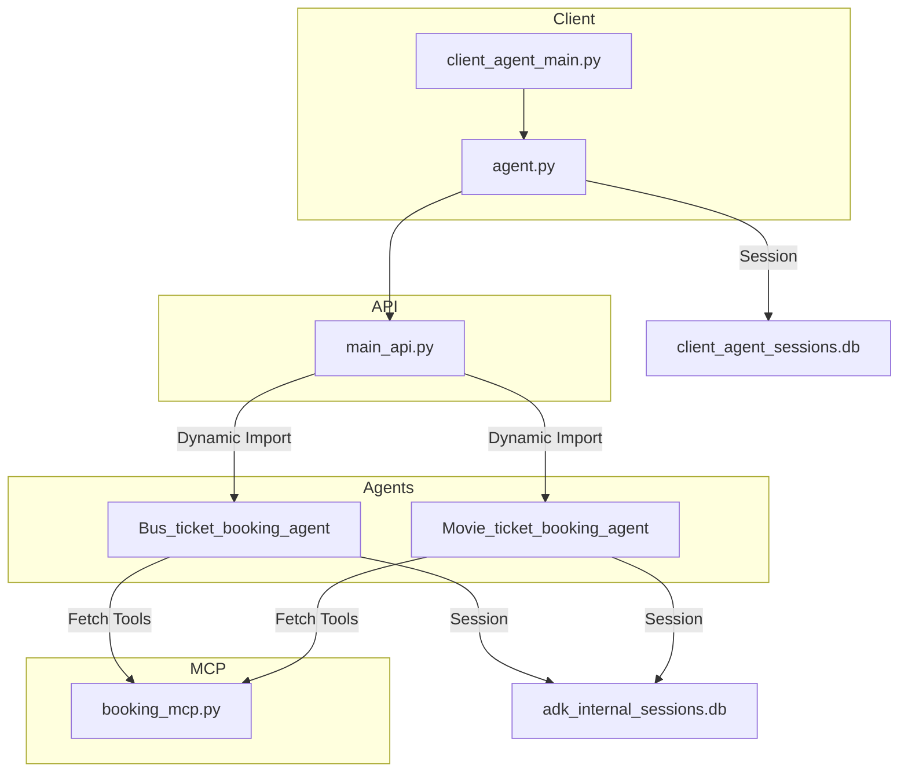

# Covasant-Booking-Agent

## Overview

Covasant-Booking-Agent is a modular, multi-agent system for handling ticket booking operations for various domains (such as bus tickets and movie tickets). The architecture separates concerns between client interaction, agent orchestration, domain-specific logic, and backend session management, leveraging FastAPI, SQLAlchemy, and Google Cloud APIs.

---

## Table of Contents

- [Project Structure](#project-structure)
- [System Architecture](#system-architecture)
- [Key Components](#key-components)
  - [Client Booking Agent](#client-booking-agent)
  - [Agents API Layer](#agents-api-layer)
  - [Domain Agents](#domain-agents)
  - [MCP Servers](#mcp-servers)
  - [Session Databases](#session-databases)
- [Detailed Flow](#detailed-flow)
- [Technology Stack](#technology-stack)
- [How to Run](#how-to-run)
- [Extending the System](#extending-the-system)
- [Contributing](#contributing)
- [License](#license)

---

## Project Structure

```
booking_agent/
│
├── agents/
│   ├── main_api.py
│   ├── adk_internal_sessions.db
│   ├── Bus_ticket_booking_agent/
│   └── Movie_ticket_booking_agent/
│
├── client_booking_agent/
│   ├── agent.py
│   ├── client_agent_main.py
│   ├── client_agent_sessions.db
│   └── .env
│
├── mcpservers/
│   └── booking_mcp.py
│
├── requirements.txt
└── ...
```

---

## System Architecture

The architecture is organized into distinct layers:

- **Client Layer**: Handles user interaction and session initiation.
- **API Layer**: Central FastAPI service that manages agent lifecycle, routing, session control, and orchestrates task delegation.
- **Domain Agents**: Encapsulate logic for specific domains (bus, movie, etc.), loaded dynamically.
- **MCP Servers**: Backend logic modules for business rules and booking orchestration.
- **Databases**: Separate SQLite databases for client and agent session management.

See the [Architecture Diagram](#system-architecture-diagram) for a visual overview.

---

### System Architecture Diagram



---

## Key Components

### Client Booking Agent

- **Files**: `client_booking_agent/agent.py`, `client_booking_agent/client_agent_main.py`
- **Responsibilities**:
  - Initiates booking sessions for users via API calls.
  - Handles user preferences and session state.
  - Reads/writes to `client_agent_sessions.db` for session persistence.
  - Loads configuration and secrets from `.env`.
  - Communicates with the API layer via HTTP (FastAPI).

---

### Agents API Layer

- **File**: `agents/main_api.py`
- **Responsibilities**:
  - Exposes RESTful endpoints for clients and external systems.
  - Dynamically loads domain agents based on requests.
  - Manages session state in `adk_internal_sessions.db`.
  - Delegates domain-specific tasks to the appropriate agent.
  - Orchestrates communication with MCP servers for business logic.
  - Integrates with Google Cloud APIs for authentication, AI, and other services.

---

### Domain Agents

- **Folders**: `agents/Bus_ticket_booking_agent/`, `agents/Movie_ticket_booking_agent/`
- **Responsibilities**:
  - Encapsulate business logic for their respective domains.
  - Loaded dynamically by the API layer.
  - Interact with backend DB for session and state.
  - Implement agent-specific endpoints and logic (e.g., finding buses, confirming bookings).

---

### MCP Servers

- **File**: `mcpservers/booking_mcp.py`
- **Responsibilities**:
  - Implements core business rules for bookings.
  - Handles orchestration and validation logic.
  - Communicates results and state back to the API and agents.

---

### Session Databases

- **Files**: `client_agent_sessions.db`, `adk_internal_sessions.db`
- **Responsibilities**:
  - Store session state for clients and agents respectively.
  - Used for recovery, audit, and ongoing session management.

---

## Detailed Flow

1. **Session Initiation**:  
   The client agent starts a session by sending a request to the API (`/client/start_session`).  
2. **Agent Selection**:  
   The API layer dynamically loads the appropriate domain agent based on the booking type (bus, movie, etc.).
3. **Business Logic Delegation**:  
   The API calls MCP servers to process business rules, availability, seat selection, and confirmation.
4. **Session State Management**:  
   Each step updates the session DBs for both client and agent scopes.
5. **Result Delivery**:  
   The client receives booking results, and the session can be resumed or queried as needed.

---

## Technology Stack

- **Python 3.9+**
- **FastAPI** (REST API)
- **SQLAlchemy** (ORM)
- **Google Cloud Libraries** (AI, Auth, Storage, etc.)
- **SQLite** (Session DBs)
- **Starlette, Uvicorn** (ASGI Server)
- **Pydantic** (Settings & validation)
- **TQDM, Requests, PyYAML, etc.** (Utility libraries)

---

## How to Run

1. **Install dependencies:**
    ```bash
    pip install -r requirements.txt
    ```

2. **Set up environment variables:**  
   Copy the `.env` file and fill in required fields (API keys, DB URLs, etc.).

3. **Initialize session databases:**  
   Databases will be created automatically on first run.

4. **Run the main API server:**
    ```bash
    uvicorn booking_agent.agents.main_api:app --reload
    ```

5. **Run the client agent (for testing):**
    ```bash
    python booking_agent/client_booking_agent/client_agent_main.py
    ```

---

## Extending the System

- **Add a new domain agent**:  
  1. Create a new folder under `agents/` (e.g., `Flight_ticket_booking_agent/`).
  2. Implement agent logic and ensure it exports the expected agent interface.
  3. Register the agent in the API layer if necessary (dynamic loading is supported).

- **Integrate new business rules**:  
  Update or add logic to `mcpservers/booking_mcp.py`.

- **Add external integrations**:  
  Use Google Cloud libraries or add new third-party service clients as needed.

---

## Contributing

Please submit issues or pull requests for bug fixes, enhancements, or new agents.  
Code should follow PEP8 style and include docstrings.

---

## License

[Specify your license here, e.g., MIT, Apache-2.0]

---

## Authors

Main contributors: [JogannagariSaiCharanReddy](https://github.com/JogannagariSaiCharanReddy), [yaswanth-y8](https://github.com/yaswanth-y8), and others.
